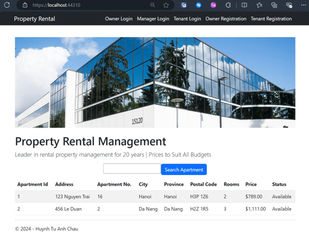
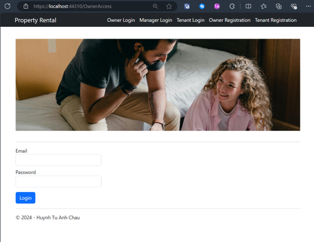
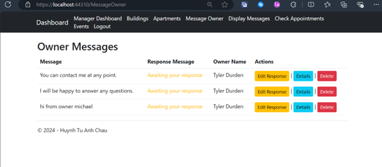
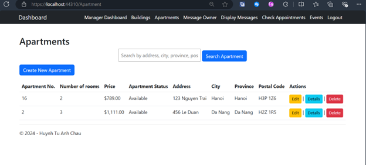
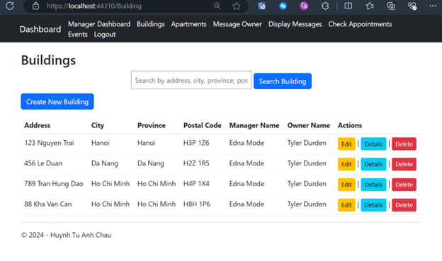
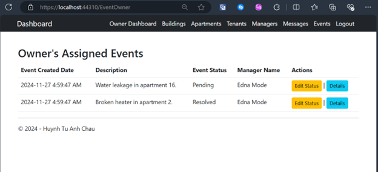
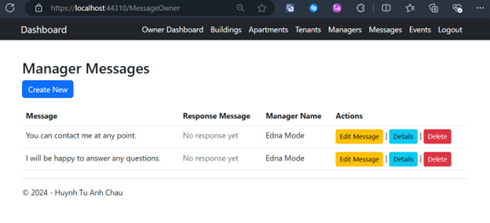
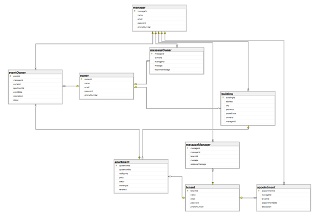

# Rental Management System

This repository contains the Property Rental Management System project, designed to facilitate seamless interactions for Property Owners, Managers, and Tenants.

## 📝 Description

The Property Rental Management System is a web application built using **ASP.NET MVC** and **Entity Framework (Database First approach)**. It provides session-based tracking and ensures user-friendly CRUD (Create, Read, Update, Delete) operations tailored for each user role.

The project emphasizes:
- **ASP.NET MVC Framework** for structured development.
- **Entity Framework** for database management.
- **Responsive Design** for better usability.

Development was conducted in **Visual Studio 2022**, and the database was managed using **SQL Server Management Studio (SSMS) 19**.

## 🚀 Deployment

Deployed for testing purposes on December 4th, 2024. The system currently supports one Owner at a time for testing and validation.

## 📋 Requirements

To run this project, ensure the following are installed:
- **Visual Studio 2022**
- **SQL Server Management Studio (SSMS) 19**

### User Roles and Features

**Owners** can:
- Manage managers' and tenants' accounts (CRUD).
- Manage buildings, apartments, and assigned events.
- Communicate with managers through messages.

**Managers** can:
- Manage buildings, apartments, events, and appointments.
- Communicate with owners and tenants through messages.

**Tenants** can:
- Register, view available apartments, and make appointments.
- Communicate with managers through messages.

## 🎨 Features

- **Role-Specific Dashboards**: Tailored dashboards for Owners, Managers, and Tenants.
- **Session-Based Security**: Access control based on user roles.
- **CRUD Operations**: Comprehensive functionality for managing resources.

## 📦 Screenshots

### Home Page

### Owner Login

### Manager Dashboard

### Manager - Apartments Management

### Manager - Buildings Management

### Owner - Events Management

### Owner - Manager Communication

### System Diagram

---

## 🛠 Project Files

- **script.sql**: SQL script for database initialization.
- **2231473_HuynhTuAnhChau_Report.docx**: Detailed project report.
- **imgs/**: Folder containing all screenshots and diagrams.

---

## Conclusion

This project provided hands-on experience with:
- Implementing ASP.NET MVC and Entity Framework for efficient web development.
- Designing and testing user-friendly and secure web interfaces.

Sample user credentials for testing:
- **Owner**: tylerdurden@gmail.com / password123
- **Manager**: ednamode@gmail.com / password123
- **Tenant**: michaelcorleone@gmail.com / password123
